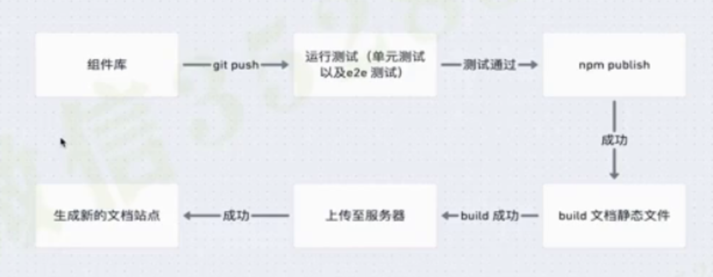

# 最终Npm发布+CICD集成

## 一、npm简介

npm作为一个命令行工具，使你可以方便的下载安装升级删除包，也可以让你作为开发者发布一个包并且维护包

- Npm的主要功能
  - 下载别人编写的第三方包到本地使用
  - 下载并安装别人编写的命令行程序到本地使用(如create-react-app这种命令行工具)
  - 将自己编写的包或者命令行程序上传到npm服务器供别人使用

当将我们包发布成功上去之后，每个包在npm官网上都对应一个页面，发布前我们得注册一个npm账号。

- npm账号注册登陆
  - 可以在网站页面注册登陆
  - 也可以在命令行中检查注册登陆
    - 用npm whoami命令检查一下是否登陆，然后用npm adduser来注册或登陆
    - npm config ls来查看当前npm设置信息
    - 使用命令注册登陆时应删掉淘宝镜像用源镜像

## 二、发布publish

在publish前，先在packagejson中添加些信息

### 2.1 语义化版本version命名规则

[语义化版本文档](http://www.u396.com/semver-range.html)

### 2.2 添加packagejson属性信息

version：版本号参照上面文档
private：false// 不是一个私有的包
description：描述你包的具体简要内容
author：作者名称
license：“MIT”是开源软件遵守的协议可以选MIT
keywords：["Component","UI","React"] 一些关键词的搜索
homepage：项目的主页，或GitHub地址当做gh-pages部署时必填主页
repository：{"type":"git","url":"hjk"}
files：["dist"] //这个数组代表要把哪些文件上传上去，只把dist包发布上去，源码不发布上去

### 2.3 发布的准备工作

- publish之前要编译生成下最新的代码，所以我们要添加一个自动运行的钩子函数prepublish(在publish之前做的事) -- 以npm scripts命令的形式写上
- 然后npm publish 发布成功

## 三、精简package.json依赖

存在的问题：现在我们组件库的依赖很多，package中依赖分为两类：
dependencies：属于运行项目业务逻辑需要依赖的三方库，当npm install时该节点下依赖都会被下载安装到node_modules中
devDependencies：开发模式工作流下需要依赖的第三方库也就是与最终功能模块无关的依赖，如单元测试，语法转换，eslint工具，css预处理器和一些module bundler(webpack)等等

- 目前项目中save中依赖有很多应该放到dev里面去，当时就没正确安装对，我们需要将些依赖转移到dev(devDependencies)中去。
  - 可以把@types/的文件都移动过去，这些都是声明文件对线上展现没什么用，直接将对应属性值剪切到dev那个属性中去
  - node-sass是个预处理器也转移到dev里面去
  - react-scripts也是个开发时需要的工具，也转移过去
  - typescript也是开发需要的对线上结果没用，也给转移过去

- react版本误被重复安装两次的问题解决(5章遇到的)
  - 核心依赖库必须先下载安装，不能脱离核心依赖库被单独依赖并且引用
  - packagejson提供一个"peerDependencies"字段: {"react": ">= 16.8.0","react-dom": ">=16.8.0"}
   当你在项目中使用npm install时，peerDependencies中的依赖不会被npm自动安装，它会输出npm命令行中的的warn的日志，让你在用户级别的项目中安装peer的依赖即可，这样就解决了安装多次react的问题，然后把react和react-dom从save级的依赖中删去。
  - 但是本地开发组件库安装时也安装不到两依赖，开发的时候还得需要这两个依赖的，把他移到dev依赖中去就可以了

## 四、添加prepublish和commit 前检查

对于组件库来说，代码质量非常重要，每次发布或者commit时假如代码出现了bug，对用户来说是非常致命的，单元测试用来保证代码尽量减少bug，代码规范有助于项目维护，为了防止一些bug和不规范的代码被commit push到远程仓库中，防止被用户publish，我们需要一些钩子函数来首先验证开发者是否通过了这两项流程：代码规范和单元测试都没有问题，然后才能进行commit或publish，这种需求在大团队项目中非常常见。

### 4.1 prepublish完成

#### 4.1.1 完成代码规范的检查任务

create-react-app和storybook都已经自带安装了ESLint工具，所以我们当时在开发的时候就能看到各种提示，现在让我们添加一个单独的命令，让它手动运行把这个eslint检查功能单独地剥离出来
我们需要在项目中安装下[ESLint命令行工具](https://eslint.org/docs/user-guide/getting-started)
> 所有想让代码自动执行各种命令行工具命令都可以借助npm scripts来完成
所以我们在npm scripts新加个eslint检查的命令："lint":"eslint --ext js,ts,tsx src"
即在src下面测试检查js，ts，tsx结尾的文件---运行完后，仅仅有warining没有error，eslint是给通过的，我们可以给命令设置--max-warnings(运行允许warning最多的数量)
`"lint":"eslint --ext js,ts,tsx src --max-warnings 5"`允许做多是5个。

#### 4.1.2 添加测试的任务

cra项目的test命令是react脚手架安装自带的，他是开发时候用的，他不会返回一个最终的结果，不会给出通过或没通过的结果，他还是处于watch的模式的
我们需要这个命令让他和lint命令一样可以直接返回结果，这个需要参考[create-react-app官方文档](http://create-react-app.dev/docs/running-tests/#continuous-integration)
来稍微配置下他的test命令即可
即：按官方说，设下它的CI全局变量为true时就能所有都测试一遍并返回结果，(默认不返回结果的哦)不同操作系统设置CI变量的方式不一样，我们推荐个小工具叫：***cross-env***，他可以很方便的跨平台来设置环境变量`npm i cross-env --save-dev`,安装完毕以后可以写这个命令：
也是在npmscripts下写`"test:nowatch": "cross-env CI=true react-scripts test"`

#### 4.1.3

有了两个单独的命令后，我们就可以给prepublish添加步骤了：`"prepublish": "npm run test:nowatch && npm run lint && npm run build"`

### 4.2 git commit钩子--“哈士奇”

我们npm中没有现成的类似precommit命令啥的，我们可以求助一个叫：**Husky**的(小狗哈士奇)工具，他专注做一件事使git hooks更容易，他主要就是commit前或push前进行一个检查。
`npm install husky --save-dev`
注意：要求node版本>=10,且git版本>=2.13.0

```javascript
    // 哈士奇安装完毕后将下段代码粘贴下即可
    //package.json文件
    {
        "husky": {
            "hooks": {
                "pre-commit": "npm run test:nowatch && npm run lint",
                "pre-push": "自定义一些命令等等",
                "...": "..."
            }
        }
    }
```

最终，通过配置publish和commit的钩子函数运行单元测试和lint工具是一个中大型项目的基本做法，为了让更多的同学写出具备规范没有bug的代码这种做法必不可少。

## 五、Storybook生成静态页面

先给packagejsonnpmscrips添加上一个自带的storybook命令：`"build-storybook": "build-storybook -s public"`
这个命令能构建所有的stories.js文件生成一个storybook-static文件夹即成一个静态资源打包文件待线上使用。

### 5.1 增添欢迎页面

> 新建src/welcome.stories.tsx文件
添加完发现欢迎页不是首页，需要在.storybook/config.tsx配置文件中调下stories的展示顺序，需要把welcome放到最上面详细见文件的loaderFn的写法

- 然后build-storybook构建成静态资源文件，就可以直接放在服务器上展示组件库可视化页面了

## 六、CICD

见发布流程图
问题：每次发布更新版本都得手动经过这些流程，很麻烦要解决这些问题我们就得有自动化的工作流，在本地实现一次git push以后就会自动完成图中那些中间任务-----所以我们需要了解下**CICD概念**

### 6.1 CI - 持续集成Continuous Integration

- 频繁的将代码集成到主干(master)
- 快速发现错误(每完成一点更新就集成到主干可以快速发现错误)
- 防止分支大幅度偏离主干(如果不是经常集成，主干又在不断更新会导致以后集成的难度变的越来越大)
- 目的就是可以让产品快速迭代，同时还能保证比较高的质量

### 6.2 CD - 持续交付、持续部署

当CI完毕后集成到主干后，就该持续交付了。

- 频繁的将软件的新版本，交付给质量团队或者用户以供评审(持续交付)
  - 然后交由qa进行测试，若测试通过，那么代码就进入生产阶段
- 代码通过评审以后，自动部署到生产环境(持续部署)
  - 持续部署的前提是能够自动化完成测试构建部署等步骤

### 6.3 自动化平台工具---travis初级用法

> [Travis-CI](http://travis-ci.com)

有一个平台叫Travis CI，它是一个在线的CICD平台，最简单用来测试部署软件产品的一个平台，可以完美的集成gihub，完全托管掉我们的github仓库由travis来管理运行，并且有非常简单的用法

- 能实现每次push以后自动运行测试并且可以监控测试以后的结果

- travis-ci最基本的就是由一个.travis.yml文件所控制的，将这个文件添加到你项目根目录中，然后在文件里面添加一些配置，添加完这个文件以后push到github上就可以触发构建了,注意是下一次push才会触发build
- 最简单的一次流程就是：安装依赖，运行测试等还有更多功能
- js语言是如何使用travis的：
  - 会发布后先执行默认安装：npm install 或 npm ci
    - 若有packagelock.json的话就执行npm ci，他是锁定当前版本依赖的，npm ci和npm install区别就在于它会直接从pakagelockjson中安装包，然后使用packagejson来验证，假如和lockjson的不一致的话，就会直接抛出错误并且停止
  - 若有yarn.lock的话(yarninstall的时候)，travis会默认使用yarn来安装，我们本地使用的都是npm，用yarn可能会有问题，所以有的话给他删除掉
- 然后新建.travis.yml文件，详见文件
- 最后执行git add .,git commit -m,git push

**问题：**
·  - push后travis托管的github仓库就能接受到我们的项目了，并执行npm install，发现个问题当它npm install的时候会执行prepublish命令：
      - prepublish命令在npm install的时候和npm publish的时候都会被运行到，它已经是一个要被废除的命令，我们要把他换成prepublishOnly这个命令只会在publish前运行

### 6.4 travis高级用法

> 其实CICD的精髓就是持续部署，自动化你的工作流程，这节课就来完成自动化的事情，

我们完成的文档页面是由storybook生成的，我们可以生成一系列的静态文件，现在我希望把这些生成的静态文件，上传到github pages里面去(github推出的一个静态站点的功能你可以将静态文件存放到ghpages这个分支中，然后就可以通过一个特定的url来访问这个站点，对于项目的文档页面比较合适)

- 手动操作比较繁琐，我们先要在本地运行npm build-storybook生成静态文件，然后新建个ghpages的分支，把文件都拷贝过去然后在push上去就很麻烦-------但使用travis我们可以轻松实现每次push以后自动部署
- 参照travis tutorial自动部署那一块文档，就是往.travis.yml文件添加些deploy属性配置拷贝过来就好
- 在yml配置文件中得再加下scripts属性，告诉travis构建时指定执行该项目的哪个脚本，默认执行是npm test命令，现在我们写成

```javascript
script:
    - npm run build-storybook
```

生成静态文件命令

- 然后github_token是环境变量修改成大小写都可以
- 然后在yml配置文件中deploy的值中加个local_dir：storybook-static  即告诉你我要上传哪个文件夹里的内容默认是build文件夹
- 然后把keep_history: true删掉不用它就行
- on：branch master意思就是哪个branch有push的时候就触发这个deploy动作，我们可以根据我们项目情况改成我们的branch名称
- 最后我们要配置下github_token,得去github官网操作
  - 去github官网个人设置里Settings/Developer settings/Personal access token页面生成个token(记得勾选repo相关的权限否则会部署失败没权限)即可，生层以后把token拷贝过来去travis你工作台页面的Moreoptions/Settings/环境变量处添加个环境变量，变量名称一定要跟你yml文件里的名字对应(不带$符)
- 最后addcommitpush部署成功了

- 最后记得在仓库的settting里设置gh-pages的展示分支即可
**访问站点地址：**<https://github用户名.github.io/项目名/>

其实travis自动化流程特别多可以实现之前说的各种场景，比如自动publish到npm，自动部署到指定的服务器等等，这里就简单介绍几个基本功能，更多功能自行探索
